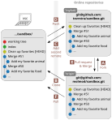
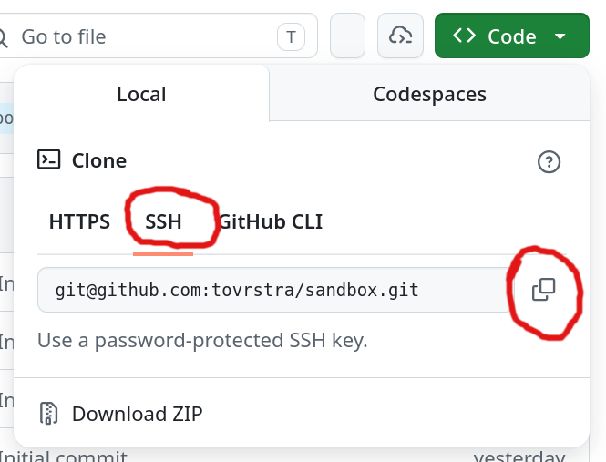

<!--
SPDX-FileCopyrightText: © 2026 Toon Verstraelen <Toon.Verstraelen@UGent.be>
SPDX-License-Identifier: CC-BY-4.0
-->

# Working with Git in the terminal

This guide assumes you have already gone through [`handson_web.md`](handson_web.md).

## Overview

The goal of this guide is to replicate the workflow of `handson_web.md` using a terminal-based Git client, instead of the web interface of GitHub.

The instructions below assume that you will use Git on the Donphan cluster of the VSC.
Some familiarity with virtual terminals and the [`nano`](https://www.nano-editor.org/) editor is also assumed.

You can also follow the instructions below on any other computer, provided you have the necessary software installed:

- A virtual terminal running `bash` or `zsh`.
- A recent version of Git
- An SSH client
- A text editor, e.g. `nano`.

## Virtual terminal on VSC

Take the following steps to open a virtual terminal on the VSC cluster.

1. Go to [login.hpc.ugent.be](https://login.hpc.ugent.be)
   and click `Interactive Apps` -> `Shell (tmux)` in the blue bar.

1. Select the Donphan cluster from the list of clusters and request 2 hours.
   Other settings can be left to their defaults.
   Finally, scroll down and click the blue `Launch` button.

1. A job is started on Donphan for your tmux shell.
   After a minute, you should be able to click the blue `Connect` button to open the shell.

Now your virtual terminal is ready for the instructions below.

Note that copying and pasting in tmux are a bit different:

- **Select and copy** to clipboard

  - Line: `[Shift] + [LeftClick & Drag]`
  - Block: `[Shift] + [Alt] + [LeftClick & Drag]`

- **Paste** from the clipboard

  - `[Shift] + [Insert]`
  - `[Ctrl] + [Shift] + V`

## Configure Git

(This concerns local settings on your computer or VSC account.)

When you locally commit modifications to a Git repository, some metadata is also recorded, such as the author and the time of the commit.
To make sure the author is set correctly, configure Git with the following commands:

```bash
git config --global user.name "Your Name"
git config --global user.email Your.Name@UGent.be
```

Where you make the following changes:

- Replace `"Your Name"` by your actual name, such as `Toon Verstraelen`.
- Replace `Your.Name@UGent.be` by your UGent e-mail.

The following settings are also recommended:

```bash
git config --global init.defaultBranch main
git config --global core.editor nano
git config --global pull.rebase true
```

It is more common these days to use `main` as the default branch name instead of `master`, which is the historical default.
The rebase setting is recommended to avoid unnecessary merge commits when pulling changes from the server.

## Configure SSH

Your local Git client can communicate with GitHub (and other online repositories) using the so-called [secure-shell](https://en.wikipedia.org/wiki/Secure_Shell) protocol, or SSH.
For this to work, you need to configure SSH on your computer.

### Create a key pair (and understand what that means)

When connecting to a remote server, it needs to verify your identity (called authentication), which is done through a so-called SSH key pair.
An SSH key pair consists of a public and a private key.
The public key may be shared with any server interested in authenticating your connections.
When you make a connection, the authentication is only possible when you possess the corresponding private key.
For sensitive work, the private key is usually stored in encrypted form on your laptop, which we'll skip here for convenience.

In a terminal window, a key pair is generated by the following command.

```bash
ssh-keygen -f ~/.ssh/id_github_com
```

When `ssh-keygen` asks something, just press `[Enter]` without filling in anything.

You will see something like this:

> ```
> Generating public/private rsa key pair.
> Enter passphrase (empty for no passphrase):
> Enter same passphrase again:
> Your identification has been saved in .../.ssh/id_github_com
> Your public key has been saved in .../.ssh/id_github_com.pub
> The key fingerprint is:
> SHA256:pFxrv91Ql70JwiZM5to2wzQ6zLNKFB8tpgHwBhV0KFU vsc40019@gligar11.gastly.os
> The key's randomart image is:
> +---[RSA 3072]----+
> | o=*+E           |
> | .o.o   .        |
> |  .o o +o+       |
> |  .  .*+B..     o|
> |     oo.S* + ...o|
> |    . o.*.+ ....o|
> |     . B *. .  o |
> |    .   = oo o   |
> |     ...  . . .  |
> +----[SHA256]-----+
> ```

The result is a non-encrypted private key, stored in the default location.

The reason we don't recommend a passphrase is that it only provides limited additional security in exchange for considerable inconvenience.
Key encryption mainly adds an extra layer of protection in case somebody gains access to your computer.
This may happen by old-fashioned theft of your hardware, yet spyware is more common.
When this happens, key encryption offers limited protection, e.g. spyware can also easily steal your passphrase through key-logging.
Even old-fashioned thieves have [cheap and effective means of recovering your password](https://xkcd.com/538/).

If you care about security, the following are more effective: use up-to-date and legal software, block advertisements, and don't open questionable e-mails, attachments or web pages.

### Add the public SSH key to your GitHub account

You can show the public key on the terminal as follows:

```bash
cat ~/.ssh/id_github_com.pub
```

This will show something like this:

> ```text
> ssh-rsa AAAAB3NzaC1yc2EAAAADAQABAAABgQC7...
> ```

Copy the entire public SSH key **from your terminal** and paste it into your [GitHub SSH key settings](https://github.com/settings/keys).
This provides GitHub with the necessary information to authenticate you.

### Configure your SSH client to use your key

Your SSH configuration can be found in `~/.ssh/config`, if it already exists.
If not, you can create it with the following commands:

```bash
mkdir -p ~/.ssh
touch ~/.ssh/config
```

Then run the command `nano ~/.ssh/config` to edit this `config` file and copy-paste the following:

```text
# Disable X11 by default, only switch on for relevant hosts.
ForwardX11 No
ForwardX11Trusted No
ServerAliveInterval 15

# Do not try any SSH key for any connection,
# because this may lead to problems with multiple keys.
IdentitiesOnly yes

Host github.com
    Hostname github.com
    IdentityFile ~/.ssh/id_github_com
```

[Nano](https://www.nano-editor.org/) is a basic keyboard-only text editor.
When done editing, press `[Ctrl] + x`, type `y` and press `[Enter]` to save the file and exit Nano.

To improve your security, the following could be considered:

- Use different keys for different connections.
  (If one key is leaked, the other connections are not compromised.)
- Replace your keys on a yearly basis.

### Check if your key works for github.com

Try the following command in the virtual terminal:

```bash
ssh git@github.com
```

You should get something like:

> ```
> The authenticity of host 'github.com (140.82.113.4)' can't be established.
> ECDSA key fingerprint is SHA256:en/5EHNM0cR+WCAybnlftW+0l13R3m5S9XUjUdXfRvg.
> Are you sure you want to continue connecting (yes/no/[fingerprint])?
> ```

Type `yes` and press Enter. You should see the following:

> ```
> PTY allocation request failed on channel 0
> Hi zzzzzzzz! You've successfully authenticated, but GitHub does not provide shell access.
> Connection to github.com closed.
> ```

Congratulations! Your SSH key is working and you can now use the commands below to interact with GitHub repositories.

## Most important Git commands

There are several `git` commands in the instructions below
to interact with a local Git repository on your VSC account.
A detailed description of all these commands can be found in the [Git Reference Documentation](https://git-scm.com/docs).
Here we provide a list of the most important commands, a link to their documentation and a one-line summary of what they do.

| Command                                                 | Summary                                                                       |
| ------------------------------------------------------- | ----------------------------------------------------------------------------- |
| [`git config`](https://git-scm.com/docs/git-config)     | change or view your local Git settings                                        |
| [`git clone`](https://git-scm.com/docs/git-clone)       | make a local copy of a remote git repository.                                 |
| [`git status`](https://git-scm.com/docs/git-status)     | show a summary of changed, removed and added files in your work directory.    |
| [`git log`](https://git-scm.com/docs/git-log)           | show the Git history (of your current branch), press `q` to quit.             |
| [`git diff`](https://git-scm.com/docs/git-diff)         | show line-by-line changes between your working directory and the index.       |
| [`git add`](https://git-scm.com/docs/git-add)           | copy a file from your working directory to the index, to prepare a commit.    |
| [`git rm`](https://git-scm.com/docs/git-rm)             | remove a file from the Git repository. (It will remain in the older commits.) |
| [`git mv`](https://git-scm.com/docs/git-mv)             | move or rename a file in the Git repository.                                  |
| [`git restore`](https://git-scm.com/docs/git-restore)   | undo `git add`                                                                |
| [`git commit`](https://git-scm.com/docs/git-commit)     | add a commit with file changes in the index to the Git history                |
| [`git push`](https://git-scm.com/docs/git-push)         | upload new commits in your local Git history to an online repository          |
| [`git pull`](https://git-scm.com/docs/git-pull)         | download commits to your local repository and update your working directory.  |
| [`git fetch`](https://git-scm.com/docs/git-fetch)       | like `git pull` but without updating your work directory                      |
| [`git remote`](https://git-scm.com/docs/git-remote)     | list, inspect or configure repositories on remote servers                     |
| [`git branch`](https://git-scm.com/docs/git-branch)     | create, modify and manage Git branches                                        |
| [`git checkout`](https://git-scm.com/docs/git-checkout) | change the current branch HEAD and update your working directory.             |

Part of Git's steep learning curve comes from the large number of commands needed to interact with a Git repository.

## Surviving Git in the terminal

Because the `git` command can be intimidating and frustrating to newcomers, there are many graphical user interfaces, either standalone tools or built into code editors like Visual Studio Code.
We do not recommend any of these graphical tools because they hide relevant details for the sake of simplicity, making it harder to understand what you are doing with a Git repository.
A more salient approach to flatten the learning curve is to use an informative shell prompt, which constantly shows the current status of your local repository.
Some examples:

- [Powerbash](https://powerbash.org/).
  (My personal favorite. Simple, fast, and good enough.)
- [Oh My Zsh](https://ohmyz.sh/)
- [Starship](https://starship.rs/)
- [Powerline Shell](https://github.com/b-ryan/powerline-shell)
- ...

To install powerbash:

```bash
curl -s https://get.powerbash.org | bash
```

Run `powerbash` to start a new shell with the powerbash prompt.
It will start automatically in new terminal windows after installation.

## Add your favorite animal to `participants.md`

In this guide, we will practically reproduce the web-based editing of [`participants.md`](https://github.com/molmod/sandbox/blob/main/participants.md),
except that you'll add your favorite animal instead of your favorite food.

Before you start, you can already create a new issue, now reporting that your favorite animal is missing in [`participants.md`](https://github.com/molmod/sandbox/blob/main/participants.md).
To fix this issue, you will use a text editor in the terminal and the `git` command-line interface.

The main steps in the workflow are shown in the following figure:



The steps below are more detailed and refer to the letter codes in this figure.
To clarify the workflow, each command is preceded by a comment showing the current working directory.

1. Decide on a location for your local clone of the repository, e.g. `$VSC_DATA`.

   ```bash
   # ~/
   cd $VSC_DATA/
   ```

1. You should already have made a fork of the `sandbox` repository, as part of the web-based tutorial. **[A]**
   First, clone the original repository, not your fork. **[B]**

   ```bash
   # $VSC_DATA/
   git clone git@github.com:molmod/sandbox.git
   ```

   > ```
   > Cloning into 'sandbox'...
   > remote: Enumerating objects: 8, done.
   > remote: Counting objects: 100% (8/8), done.
   > remote: Compressing objects: 100% (6/6), done.
   > remote: Total 391 (delta 3), reused 5 (delta 2), pack-reused 383
   > Receiving objects: 100% (391/391), 44.84 KiB | 5.60 MiB/s, done.
   > Resolving deltas: 100% (249/249), done.
   > ```

1. Enter the `sandbox` directory.

   ```bash
   # $VSC_DATA/
   cd sandbox
   ```

1. Create a new branch named `add-favorite-animal` and check it out.

   ```bash
   # $VSC_DATA/sandbox/
   git switch -c add-favorite-animal
   ```

   > ```
   > Switched to a new branch 'add-favorite-animal'
   > ```

   (The older `git checkout -b add-favorite-animal` is equivalent.)

1. Edit the [`participants.md`](https://github.com/molmod/sandbox/blob/main/participants.md) file to add your favorite animal,
   e.g. using the `nano` editor.

   ```bash
   # $VSC_DATA/sandbox/
   nano participants.md
   ```

   After making changes, close the editor and save the file (in nano, press `[Ctrl] + x`, type `y` and press `[Enter]`).

1. Review and commit these changes to the current branch by executing the following commands **one by one**.

   - Check the current status of the repository before committing.

     ```bash
     # $VSC_DATA/sandbox/
     git status
     ```

     > ```
     > On branch add-favorite-animal
     > Changes not staged for commit:
     >   (use "git add <file>..." to update what will be committed)
     >   (use "git restore <file>..." to discard changes in working directory)
     >  modified:   participants.md
     >
     > no changes added to commit (use "git add" and/or "git commit -a")
     > ```

   - Visualize the changes you made.

     ```bash
     # $VSC_DATA/sandbox/
     git diff
     ```

     > ```diff
     > diff --git a/participants.md b/participants.md
     > index a253e8d..6dfbb93 100644
     > --- a/participants.md
     > +++ b/participants.md
     > @@ -104,4 +104,4 @@ Hint: [GitHub Emoji Cheat Sheet](https://github.com/ikatyang/emoji-cheat-sheet/b
     >
     > -1. Verstraelen, Toon
     > +1. Verstraelen, Toon :monkey:
     > ```

   - *Stage* the changes.
     This means that you select the changes to be recorded in the history of the Git repository.

     ```bash
     # $VSC_DATA/sandbox/
     git add participants.md
     ```

   - Check the status again, just to see the effect of `git add`.

     ```bash
     # $VSC_DATA/sandbox/
     git status
     ```

     > ```
     > On branch add-favorite-animal
     > Changes to be committed:
     >   (use "git restore --staged <file>..." to unstage)
     > 	       modified:   participants.md
     > ```

   - *Commit* the staged changes with

     ```bash
     # $VSC_DATA/sandbox/
     git commit -m "Add my favorite animal"
     ```

     When the commit succeeds, you will see a short summary on the terminal with the number of lines inserted and deleted:

     > ```text
     > [add-favorite-animal 03037a7] Add my favorite animal
     >  1 file changed, 1 insertion(+), 1 deletion(-)
     > ```

     This records the changes you selected in the repository history.
     The part `-m "Add my favorite animal"` is the commit message, describing the changes you're committing.
     This is typically kept short and written in an imperative mood.

     If you had omitted `-m "Add my favorite animal"`, a terminal-based text editor would have appeared.
     The first line you write in the text editor is the same as the message you'd enter on the command line.
     You may then add an empty line followed by some more elaboration in the text editor, and save the file.

   - Visualize the history of changes in the repository and observe that your commit is included.

     ```bash
     # $VSC_DATA/sandbox/
     git log
     ```

     > ```
     > commit 03037a708b9939fdae6eff9ff253bf39608e772f (HEAD -> add-favorite-animal)
     > Author: Toon Verstraelen <Toon.Verstraelen@UGent.be>
     > Date:   Sun May 3 18:35:47 2026 +0200
     >
     >     Add my favorite animal
     >
     > ...
     > ```

     Use arrow keys or page up/down to go back and forth in the history.
     Press `q` to quit `git log`.
     You may also try `git log --graph` to see all the branches.

1. When you clone a repository from a Git server, the remote repository on the server is registered on your laptop as the `origin`.
   Basic information about `origin` can be shown as follows:

   ```bash
   # $VSC_DATA/sandbox/
   git remote show origin
   ```

   > ```
   > * remote origin
   >   Fetch URL: git@github.com:molmod/sandbox.git
   >   Push  URL: git@github.com:molmod/sandbox.git
   >   HEAD branch: main
   >   Remote branch:
   >     main tracked
   >   Local branch configured for 'git pull':
   >     main rebases onto remote main
   >   Local ref configured for 'git push':
   >     main pushes to main (up to date)
   > ```

   You can add a second remote `myfork`, your fork of `sandbox`, as follows: **[C]**

   ```bash
   # $VSC_DATA/sandbox/
   git remote add myfork #URL#
   ```

   Replace `#URL#` by the URL of your fork, which you can find on the GitHub page of your forked repository.
   (You've created this fork in the web-based tutorial, but you can also create it now if you skipped that part.)
   To get the URL, do the following:

   - Browse to https://github.com/molmod/sandbox and click on `Fork` in the top right of the page.
     If you did not have a fork yet, this will create one, or it will bring you to the existing fork.

   - If you already had a fork, it may be out of date with respect to the original repository.
     To update your fork of the main branch with latest changes from the original, click on `sync fork`.

   - Now get the Git URL of this repository: click on the green `<> Code` button, then click on `Use SSH` (do not use `HTTPS`) and finally click on the copy button.

     

   If you used the wrong URL, you can always fix it later with:

   ```bash
   # $VSC_DATA/sandbox
   git remote set-url myfork #URL#
   ```

   Finally, verify that you obtained the desired result with:

   ```bash
   # $VSC_DATA/sandbox/
   git remote show myfork
   ```

   > ```
   > * remote myfork
   >   Fetch URL: (Your URL appears here)
   >   Push  URL: (Your URL appears here)
   >   HEAD branch: main
   >   Remote branches:
   >     add-favorite-animal new (next fetch will store in remotes/fork)
   >     main              new (next fetch will store in remotes/fork)
   >   Local ref configured for 'git push':
   >     main pushes to main (fast-forwardable)
   > ```

1. Push your new branch to your fork. **[D]**

   ```bash
   # $VSC_DATA/sandbox/
   git push myfork add-favorite-animal -u
   ```

   > ```
   > Enumerating objects: 8, done.
   > Counting objects: 100% (8/8), done.
   > Delta compression using up to 8 threads
   > Compressing objects: 100% (4/4), done.
   > Writing objects: 100% (4/4), 574 bytes | 574.00 KiB/s, done.
   > Total 4 (delta 2), reused 1 (delta 0), pack-reused 0
   > remote: Resolving deltas: 100% (2/2), completed with 2 local objects.
   > remote:
   > remote: Create a pull request for 'add-favorite-animal' on GitHub by visiting:
   > remote:      https://github.com/tovrstra/sandbox/pull/new/add-favorite-animal
   > remote:
   > To github.com:tovrstra/sandbox.git
   >  * [new branch]      add-favorite-animal -> add-favorite-animal
   > ```

   Open the link shown in **your terminal** to create a pull request, as you did in the web-based tutorial, and wait for it to be merged. **[E]**

1. After your pull request got merged, you can switch back to the main branch and update it with the most recent changes. **[F]**

   ```bash
   # $VSC_DATA/sandbox/
   git checkout main
   ```

   > ```
   > Switched to branch 'main'
   > Your branch is up to date with 'origin/main'.
   > ```

   You can now get the latest changes from the main repository:

   ```bash
   # $VSC_DATA/sandbox/
   git pull origin main
   ```

   > ```
   > remote: Enumerating objects: 1, done.
   > remote: Counting objects: 100% (1/1), done.
   > remote: Total 1 (delta 0), reused 0 (delta 0), pack-reused 0
   > Unpacking objects: 100% (1/1), 275 bytes | 275.00 KiB/s, done.
   > From github.com:Py4Sci/sandbox
   >  * branch            main       -> FETCH_HEAD
   >    283afa1..c47ae73  main       -> origin/main
   > Updating 283afa1..c47ae73
   > Fast-forward
   >  participants.md | 2 +-
   >  1 file changed, 1 insertion(+), 1 deletion(-)
   > ```

   You can verify with `git log --graph` that your commits and branches are indeed included.

## Epilogue

The workflow above contains a lot of steps, which may seem overwhelming at first.
You get used to them quite quickly. Practice is key.

Note that the workflow above is not the only possible workflow, but it is a common pattern.
More complex scenarios may involve multiple branches, multiple remotes, and more complex merge strategies.

Now you are ready to take the next steps in your Git journey.
Here are some more online resources to learn more about Git and GitHub:

- [Learn Git Branching](https://learngitbranching.js.org/) is an online game to practice `git` terminal commands.

- [5 Git resources for visual learners](https://about.gitlab.com/blog/2022/09/14/git-resources-for-visual-learners/) reviews several visual and interactive resources for learning Git.

- [A Visual Git Reference](https://marklodato.github.io/visual-git-guide/index-en.html)
  discusses the internals of Git in a visual way, which is useful for understanding how Git works under the hood.
